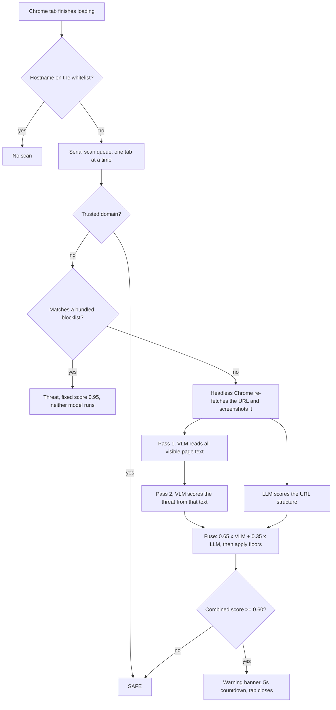

# PhishGuard — a local browser threat-detection agent built on 4-bit quantized multimodal LLMs

Browser safety tooling generally resolves a page by reputation: a URL is checked
against a remote blocklist, and the answer depends on someone having seen that
URL before. Short-lived phishing, throwaway gambling mirrors and scam redirect
chains are built to stay ahead of that lookup, and sending every URL a household
visits to a remote service to perform it carries its own cost.

PhishGuard resolves the page by looking at it instead. Each tab is rendered,
screenshotted and read by a vision-language model, while a second model reasons
over the URL string. Both models are 4-bit NF4 quantized and run on the user's
own machine, so no URL, screenshot or page text leaves the device and the system
keeps working with no network path to a threat feed.

It targets four classes: **phishing** pages impersonating a known brand, **adult
content**, **gambling and betting** platforms, and **malware or scam** pages such
as fake virus alerts and prize scams.

---

## Results

All figures below are as reported in the associated paper, which is not linked
here. The artifacts needed to recompute them are **not** in this repository, so a
reader here cannot yet check them; see
[Reproducing the evaluation](#reproducing-the-evaluation).

Evaluation covers 3,688 URLs drawn from PhiUSIIL, PhishTank, URLhaus and manual
curation. 4,000 were sampled and screenshotted; 312 failed on Cloudflare
challenges or redirect loops and were excluded.

| Class | Precision | Recall | F1 |
|---|---|---|---|
| Phishing | 92.1% | 89.4% | 0.907 |
| Adult content | 94.8% | 93.2% | 0.940 |
| Gambling / scam | 90.3% | 87.6% | 0.889 |
| Malware / scam | 88.6% | 84.9% | 0.867 |
| **Macro average** | **91.4%** | **88.7%** | **0.901** |

False-positive rate on legitimate pages is 4.8%, or 37 of 769 legitimate
samples. The paper attributes those to Cloudflare challenge pages (14),
medical and pharmaceutical sites whose age-gate disclaimers read as adult
signals (9), regulated EU and UK bookmakers such as Betfair and William Hill
that the system blocks along with unlicensed ones (8), and legitimate domains
containing a trigger substring (6).

### What each component contributes

| Configuration | Macro F1 |
|---|---|
| URL-only LLM, no VLM, no knowledge base | 0.712 |
| VLM single-pass only | 0.831 |
| VLM two-pass only | 0.857 |
| VLM two-pass + knowledge base, no LLM | 0.869 |
| VLM two-pass + LLM, no knowledge base | 0.878 |
| Full system | 0.901 |

Splitting the visual model into read and judge passes is worth 2.6 points over a
single pass. The knowledge base adds 2.3 points on top of the two model stack,
concentrated in gambling, where regional operators are absent from pretraining
data. Gambling is also where fusion helps most, at 25.5 F1 points over the
URL-only baseline.

### Cost

| Step | Time |
|---|---|
| Screenshot capture | 3–4 s |
| VLM pass 1, text extraction | 25–40 s |
| VLM pass 2, classification | 30–50 s |
| LLM URL analysis | 45–60 s |
| **Total, new unknown URL** | **103–154 s** |
| Known blocklist hit, fast path | < 1 s |
| Whitelisted trusted domain | < 0.01 s |

Combined GPU memory is 4.51 GB measured, against 4.1 GB of quantized weights,
inside a 6 GB budget. **Two to three minutes per uncached tab is the system's
governing limitation**, and the paper says so directly. "Real-time" describes a
monitoring loop that is continuous and automatic, not the per-tab latency.

---

## Reproducing the evaluation

The numbers above cannot be regenerated from this tree. Missing:

- the 3,688-URL evaluation set with labels, and the sampling rule that produced it
- per-URL predictions carrying the combined score and both model scores
- the driver that reads those predictions and emits the tables

Two things should accompany them when they are published.

**The fast path decides some cases before either model runs.** A URL matching the
bundled blocklists is resolved by `is_known_adult()` in
[`agent/agent_server.py`](agent/agent_server.py), which returns a fixed 0.95
without loading a model, and a trusted-domain hit returns SAFE the same way. On a
test set overlapping those lists, part of the reported accuracy measures the
lists rather than the models. The ablation row isolating the knowledge base gives
its aggregate contribution as 2.3 F1 points, but a per-URL record of how many
samples were settled by the fast path, against how many reached the models, would
let a reader separate the two directly.

**The per-class sample count needs a correction.** The paper states 4,000 URLs
sampled at 1,000 per class, but the results table reports five classes including
legitimate, and 4,000 across five is 800. The legitimate arm corroborates 800:
769 samples survive screenshot capture, which is 800 less 31 failures, not 1,000
less 231. The 3,688 total is consistent with 4,000 sampled, so the 1,000 figure
appears to be the error rather than the totals.

---

## Method



**Two models, two views of the page.** `Qwen2.5-VL-3B-Instruct` reads the
screenshot, `Qwen2.5-3B-Instruct` reads the URL. Both load under
`BitsAndBytesConfig` with NF4 double quantization and a bfloat16 compute dtype,
storing weights in 4 bits while computing in 16. The pair was selected against
four alternative VLMs and four alternative LLMs; it was both the most accurate
and the smallest combination that fits the 6 GB budget.

**The visual model runs twice.** The first pass is pure extraction, asked only to
transcribe every visible string: headlines, buttons, age gates, popup copy,
promotional offers. The second pass scores the threat from that transcription
plus the image. Splitting read from judge keeps the scoring prompt working over
text the model has already committed to, rather than asking it to perceive and
adjudicate in one step. The ablation puts that decision at 2.6 F1 points.

**Prompts carry the knowledge base, not the weights.**
[`agent/knowledge_base.py`](agent/knowledge_base.py) holds the domain lists and
the visual signal phrases, and those are interpolated into both prompts at
inference time. Adding a newly observed gambling platform is an edit to a Python
list and a server restart, with no retraining.

**Fusion is a weighted average followed by floors.** The stated rule is
`0.65 x VLM + 0.35 x LLM`, with a 1.2x boost when both models independently score
at or above 0.70. A cascade of floors then runs in `combine()`, raising the
combined score to a fixed value when a condition holds. Every floor sits above
the 0.60 block threshold, so when a floor fires the weighted average does not
affect the outcome. The weights decide only those cases where no floor applies,
which is narrower than equation (1) alone suggests.

---

## Install

Requires Python 3.10 or newer, Chrome or Chromium on PATH, and an NVIDIA GPU with
at least 6 GB of VRAM.

```bash
git clone https://github.com/TanvirLimon12/phishguard.git
cd phishguard
pip install -r agent/requirements.txt
pip install torch --index-url https://download.pytorch.org/whl/cu121
```

Download both models once, roughly 6 GB:

```bash
export HF_TOKEN=hf_your_token_here
python agent/download_models.py
```

## Usage

Start the agent, which loads both models and serves on `127.0.0.1:5000`:

```bash
python agent/agent_server.py
```

Load the extension from `chrome://extensions/`, enable Developer mode, choose
**Load unpacked** and select `extension/`. The toolbar badge reads `...` while a
tab is scanning, `OK` when it clears, and `BLOCK` when it does not.

Check a single URL without the extension:

```bash
python agent/phishguard.py https://example.com
python agent/phishguard.py https://example.com --headless --threshold 0.75
python agent/phishguard.py urls.txt          # one URL per line
```

Blocked pages write a screenshot and a JSON verdict into `threats/`. Pages that
clear have their screenshot deleted.

---

## Layout

```
agent/
  agent_server.py     Flask server, model loading, two-pass VLM, fusion, routes
  knowledge_base.py   Domain lists, URL patterns, visual signal phrases
  phishguard.py       Standalone CLI, same pipeline, single URL or batch
  download_models.py  One-time HuggingFace download
  requirements.txt
extension/
  manifest.json       Manifest V3
  background.js       Tab watcher, serial scan queue, banner injection, tab close
  popup.html          Toolbar UI and scan history
```

`screenshots/`, `threats/` and `logs/` are created at runtime and are not
committed.

---

## Limitations

**The blocklist matches substrings, and misclassifies legitimate sites.** The
paper reports this as the smallest false-positive bucket, 6 of 37, with
`scampi-restaurant.com` as its example. The mechanism deserves the sharper
statement, because it is not a model error and the affected pages are not
obscure. `is_known_adult()` tests `any(token in hostname for token in
ADULT_DOMAINS)`, so a short token matches inside an unrelated word, and the hit
is a hard block that returns before either model runs. Running that rule over the
shipped lists:

```bash
cd agent && python -c "
from urllib.parse import urlparse
from knowledge_base import ADULT_DOMAINS, GAMBLING_DOMAINS
for url in ['https://www.livescore.com','https://seekingalpha.com',
            'https://mgmresorts.com','https://www.vividseats.com',
            'https://stakeholder.gov.uk','https://www.coral.org']:
    host = (urlparse(url).hostname or '').replace('www.','')
    hit = ([a for a in ADULT_DOMAINS if a in host] +
           [g for g in GAMBLING_DOMAINS if g in host])
    print(url, '->', hit)
"
```

`livescore.com` and `score.org` match the adult token `score`,
`seekingalpha.com` matches `seeking`, `vividseats.com` matches `vivid`,
`mgmresorts.com` matches `mgm` and `stakeholder.gov.uk` matches `stake`. The
`.games` entry in `GAMBLING_TLDS` blocks the generic gTLD used by mainstream game
publishers, and the affiliate parameters `ref_id=`, `subid=` and `aff_id=` in
`CLICKUNDER_PARAMS` are standard across legitimate ecommerce referral programmes.
None of these six appear in the evaluation set, so the measured 4.8% does not
bound them.

**Scanning happens after the page has loaded.** The extension fires on
`changeInfo.status === "complete"`, so the user has already seen the page before
the 103–154 second scan begins. Scans are serialised to avoid GPU
oversubscription, so a burst of tabs queues behind one another.

**The screenshot is a different fetch from the one the user is looking at.** A
separate headless Chrome re-requests the URL with no cookies, no session and a
different fingerprint. The page is loaded twice, and any site that serves
different content to a headless client, which cloaked scam and phishing pages
routinely do, is judged on content the user never saw.

**Regulated bookmakers are blocked alongside unlicensed ones.** 8 of the 37 false
positives are licensed EU and UK operators. The system has no notion of
jurisdiction, and the paper lists jurisdiction-aware classification as open work.

**The logged VRAM figure is not peak usage.** Both scripts log
`torch.cuda.memory_allocated()`, which excludes reserved-but-unallocated blocks
and the CUDA context. Headroom on a 6 GB card should be checked against
`torch.cuda.max_memory_reserved()` or `nvidia-smi`.

**Trust is granted by substring, which is bypassable.** `shouldScan()` in
`background.js` tests `url.includes(w)` against the whitelist over the whole URL,
so `https://attacker.example/?x=google.com` is never scanned. `TRUSTED_DOMAINS`
also grants blanket trust to hosts serving third-party content, including
`github.io`, `t.co` and `discord.gg`, all of which are used to host phishing.

**Parts of the knowledge base are unreachable.** `SUSPICIOUS_TLDS`,
`PHISHING_KEYWORDS_IN_DOMAIN` and `URL_THREAT_WEIGHTS` are defined but imported
by neither entry point, so they describe intent rather than behaviour.

**Dependencies are unpinned and one keyword argument is version-sensitive.**
Every requirement except `qwen-vl-utils` is specified with `>=`, so the
environment that produced the reported numbers is not recoverable from this tree.
Model loading passes `dtype=torch.bfloat16`; older `transformers` releases inside
the declared `>=4.49.0` range expect `torch_dtype` and will not apply it.

**The agent will fetch any URL it is given.** `/analyze` binds to loopback with no
authentication, and any local process can make it load an arbitrary address in a
browser and write a screenshot to disk.

**Automated monitoring has a consent dimension.** The parental-control mode
records what was visited and stores screenshot evidence. Deployments involving
another person, including a child, should be visible to that person rather than
covert.

---

## License

The implementation in this repository is unmodified from its original release at
[rafi79/phishguard](https://github.com/rafi79/phishguard). This repository adds
the README, the limitations analysis and the evaluation reconciliation.

Released under the MIT License. The original copyright notice is retained in
[LICENSE](LICENSE) as that license requires.

Built on [Qwen2.5-VL and Qwen2.5](https://github.com/QwenLM/Qwen2.5-VL) from the
Qwen team at Alibaba Cloud, and on the NF4 quantization scheme from
[QLoRA](https://arxiv.org/abs/2305.14314).
